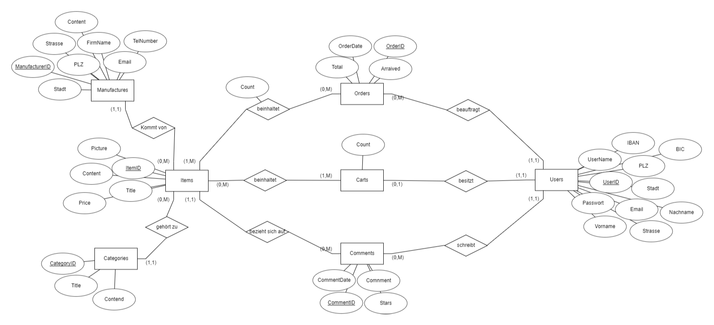

# Setup Guide
Die Seite ist auch aus dem Internet unter https://mhsl.eu/provide/frederickWebshop/ShopSite/ erreichbar.
Außerdem sind auch alle Files auch auf Github unter https://github.com/Swaggeroo/ShopSite.
## Seiten Struktur
Alle Dateien müssen in dem Shopsite Ordner bleiben und dieser muss dann direkt auf dem Root liegen.
(lochalhost/Shopsite/...)
## DB
Es muss nur eine Datenbank und Nutzer mit den nachfolgenden Daten angelegt werden:
- DB-Name: shopsite
- DB-USER: ShopSite
- DB-PASSWORD: dzOz(Q0uogT/H1zX

(Rechte: localhost - global * Berechtigung)

Danach einfach auf die seite "localhost/ShopSite/tools/setup.php" gehen dann werden alle Datenbanken etc mit Beispieldaten angelegt.
(Die Seite läd länger da er viel verarbeiten muss (1 min kann normal sein))

## Seiten Beispiel Login
- Username: TestTest (NonCaseSensitive)
- Password: Test1234

In diesem Nutzer sind bereits ein paar Bestellungen etc vorhanden

## PAYPAL
Hier sind Testanmeldedaten um das Paypal Checkout zu testen.
- Email: sb-ag0u214326978@personal.example.com
- Password: t>&]CI1l

## ER-Diagramm

# Features
## Frontend
- Responsiv
- Bewertungen
  - Mit Kauf-Verifizierung
  - Visualisierungen
- Anmeldung
- Registration
  - Pattern validation
- Sortierung
  - Preis
  - Name
  - Aufsteigend absteigend
- Filter
  - Kategorie
  - Verkäufer
- Suchfunktion
- Händlerseite
- Warenkorb
  - Lokal gespeichert wenn nicht angemeldet
  - Auf Server gespeichert und Übertragen, wenn angemeldet
- Profil
  - Accountdaten ändern
- Checkout-Seite
  - Paypal Checkout
- Kaufbestätigungsseite
- Rechnungen-Übersicht
- Rechnungen drucken
- Datenschutz
- Nutzungsbedingungen
- Viele Produkte/Tiere (73)
  - Mit Bildern
  - Mit Beschreibung

## Backend
- Ausgelagerte DB-Funktionen
- Anmeldeüberprüfung
- Input Validation
- Crossitescripting protection
- SQL-Injection protection

# Stats
## Time
- Coding 62,5h
- Total ~75h

## Code
- 5462 Total Lines
- 91 Files (ohne Bilder)
  - 31 PHP
  - 17 CSS
  - 10 JS
  - 23 SVG
